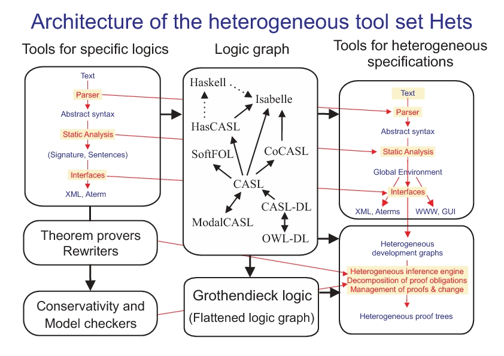

!SLIDE bullets
# Integrating Maude into Hets #
!SLIDE bullets
# Integrating Maude into Hets #

* My Diploma Thesis
* about integrating Maude
* into Hets (*…surprise!*)

!SLIDE bullets
# Who am I?

* Martin Kühl
* Informatik, University of Bremen
* `mkhl@`

!SLIDE bullets
# Hets #

* Heterogeneous Tool Set
* Parsing, Static Analysis, Proof Management
* Connects Languages and Provers

!SLIDE center

!SLIDE bullets
# Maude #

* Rewriting Logic Engine
* Logic of Concurrent Change
* Provides Executable Semantics

!SLIDE bullets
# Integration #

* More Languages, More Logics, More Power!
* Interactive Specification Development
* Object-Orientation and Concurrency
